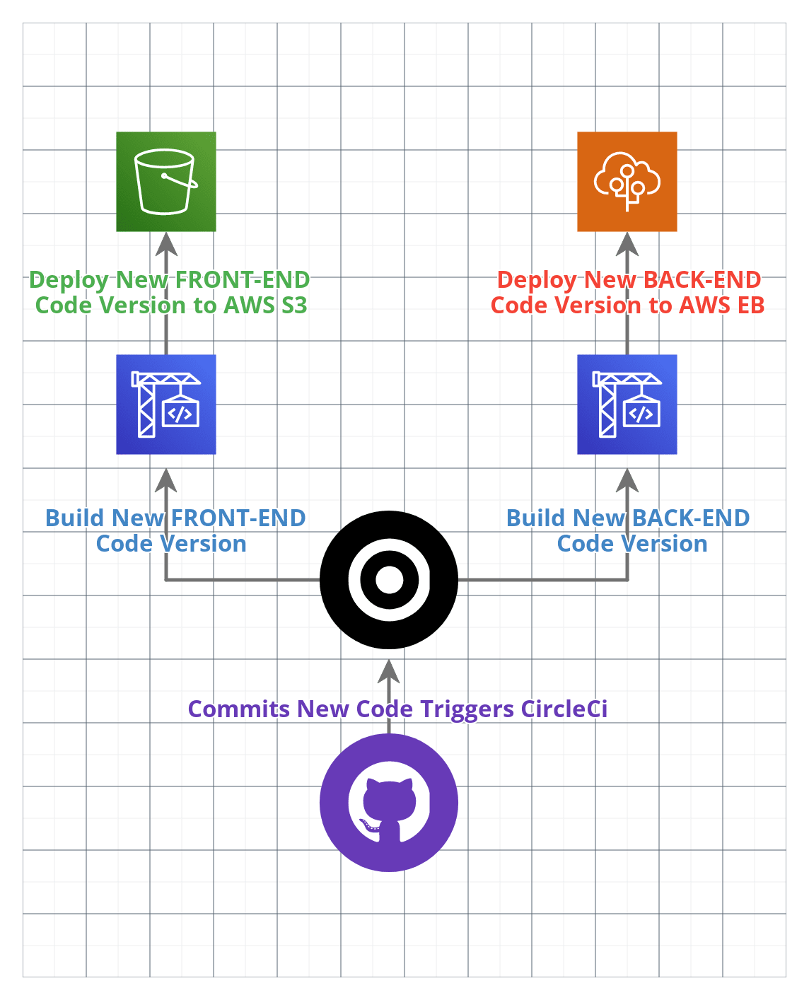

# Pipeline-Infrastructure Provided by CircleCi

# CircleCi Pipeline-Infrastructure Diagram

- ## Orbs
    - Install  
        - Node
        - AWS CLI
        - EB CLI
- ## Jobs
    - Docker Image
    - Node inatall
    - Run  
        - Node Version
        - Aws-Cli setup
        - Eb setup
- ## Run Commands
    - Front-End Install
    - Front-End Build
    - Front-End Deploy
    - Back-End Install
    - Back-End Build
    - Back-End Deploy
## Parallel runs
1. Spin up environment
2. Preparing environment variables
3. Checkout code
4. Install Node.js
5. node --version
6. Install AWS CLI - latest
7. Configure AWS Access Key ID
8. Setting Up Elastic Beanstalk CLI
9. Front-End Install
10. Front-End Build
11. Front-End Deploy
12. Back-End Install
13. Back-End Build
14. Back-End Deploy

# Screenshots of the CircleCi's Workflow
#### **Last Build**

#### **Pipeline**

#### **Environment Variables**

