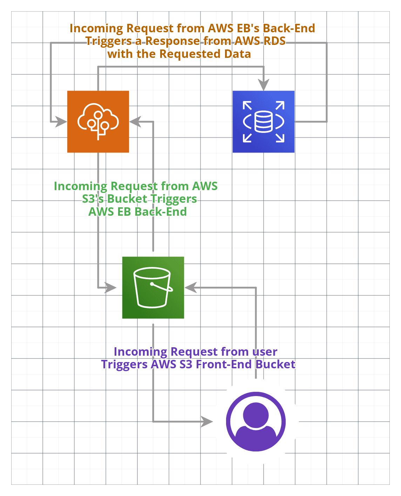
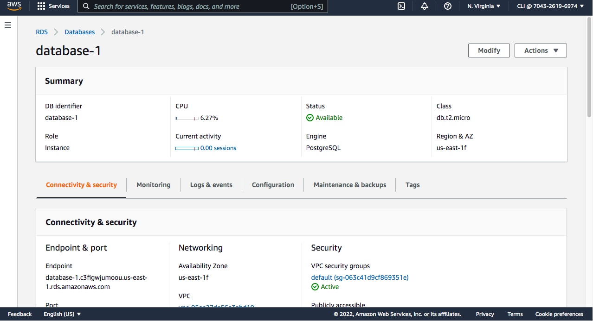
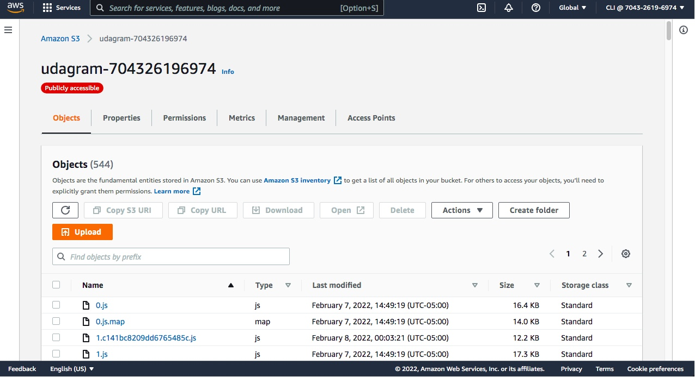
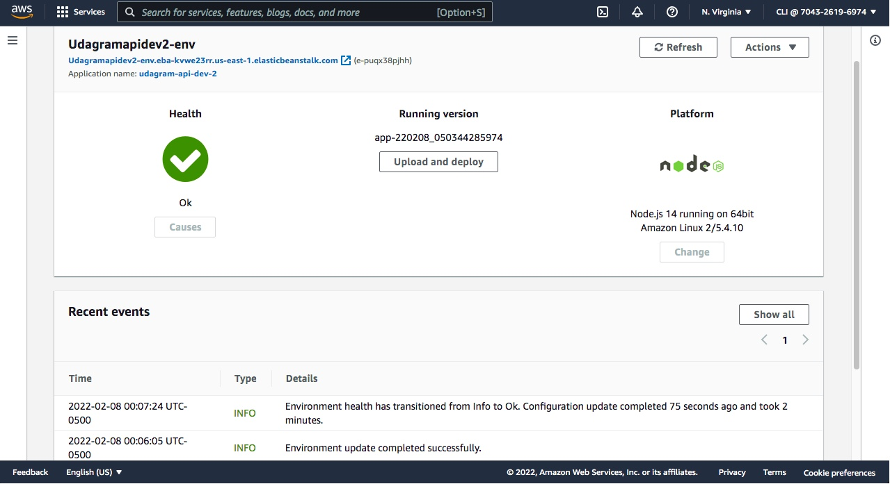

# Project's Infrastructure Provided by AWS

# AWS Project's Infrastructure Diagram

- ## RDS
    A PostgreSQL Database
- ## S3 Bucket
    For Front-End Hosting
- ## Elastic Beanstalk
    For Back-End Hosting, Run Time Environment.

# Screenshots of the AWS's Services and Helth
#### **AWS RDS**

#### **AWS S3 Front-End/Media Bucket**

#### **AWS Elastic Beanstalk**

